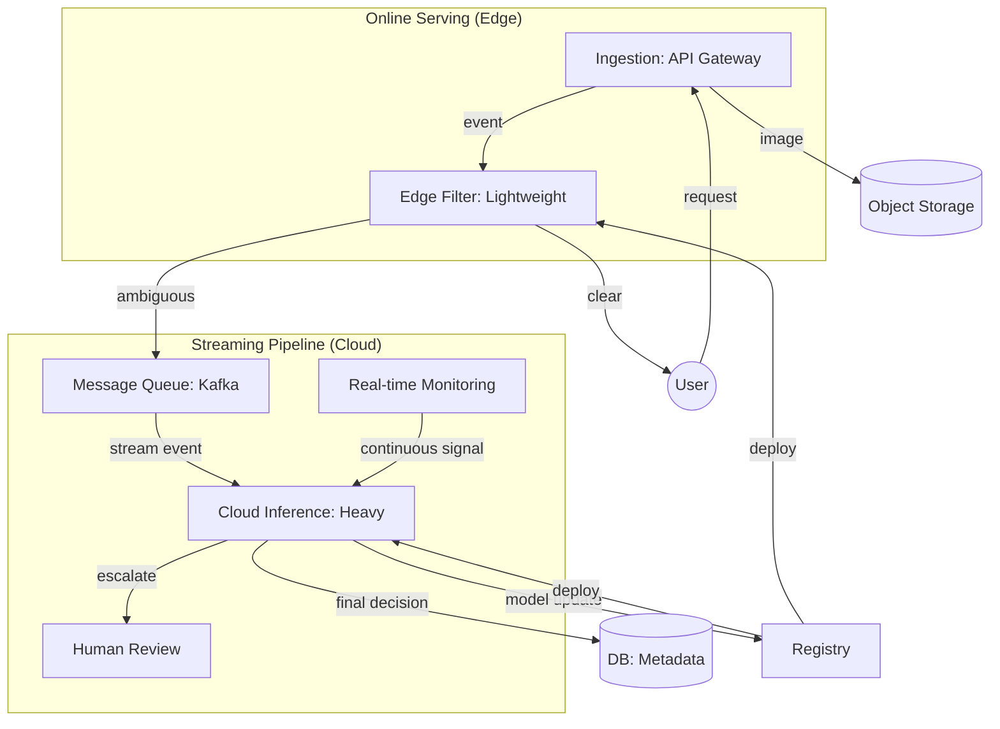

```mermaid
flowchart TD
    subgraph ONLINE ["Online Serving (Edge)"]
        ING[Ingestion: API Gateway]
        EF[Edge Filter: Lightweight]
    end

    subgraph STREAMING ["Streaming Pipeline (Cloud)"]
        MQ[Message Queue: Kafka]
        CI[Cloud Inference: Heavy]
        HR[Human Review]
        MON[Real-time Monitoring]
    end

    User((User)) -->|request| ING
    ING -->|image| OBJ[(Object Storage)]
    ING -->|event| EF
    
    EF -->|clear| User
    EF -->|ambiguous| MQ
    
    MQ -->|stream event| CI
    CI -->|final decision| DB[(DB: Metadata)]
    CI -->|escalate| HR
    
    %% Feedback Loop: Batch yox, Continuous!
    MON -->|continuous signal| CI
    CI -->|model update| REG[Registry]
    REG -->|deploy| EF & CI
```